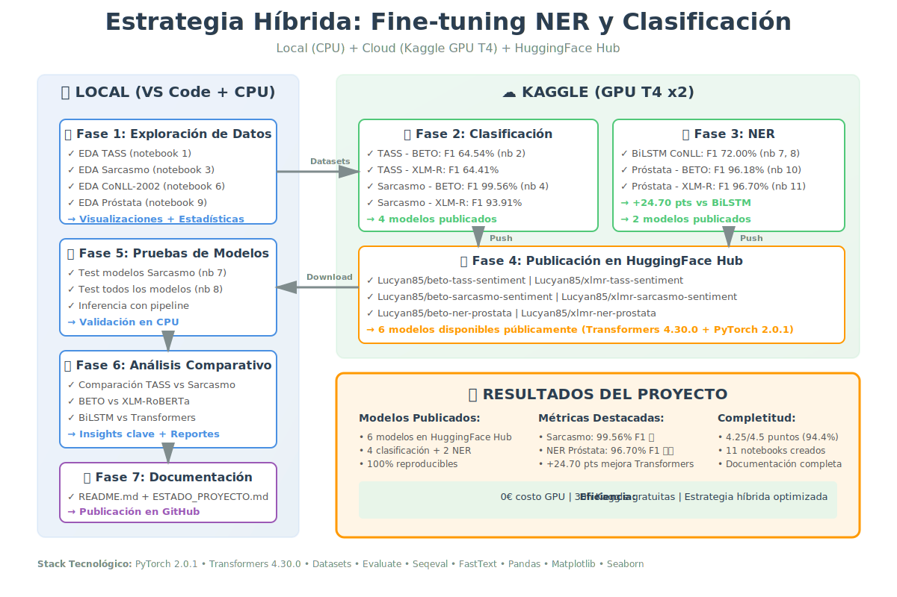

# Fine-tuning NER y Clasificación de Texto con LLMs

[](https://github.com/jaquimbayoc7/fine-tuning-nlp-transformers)
[](https://huggingface.co/Lucyan85)
[](https://www.python.org/)
[](https://pytorch.org/)
[](https://huggingface.co/docs/transformers)
[](LICENSE)


**Procesamiento del Lenguaje Natural**  
Maestría en Ciencias de la Computación para el Desarrollo de Apps Inteligentes  
Universidad del Valle - 2026  
Ing. Julian Andres Quimbayo Castro

📂 **Repositorio**: [github.com/jaquimbayoc7/fine-tuning-nlp-transformers](https://github.com/jaquimbayoc7/fine-tuning-nlp-transformers)

---

## 📋 Descripción

Proyecto completo de fine-tuning de modelos transformer para dos tareas principales:

1. **Clasificación de Sentimientos**: TASS (3 clases) y Sarcasmo (2 clases)
2. **Reconocimiento de Entidades Nombradas (NER)**: BiLSTM en CoNLL-2002

**Objetivos**: Entrenar, evaluar y publicar modelos de NLP en español usando datasets reales.

---

## 🎯 Estrategia Híbrida de Desarrollo

Este proyecto implementa una **metodología híbrida local/cloud** para optimizar recursos y eficiencia:

### 📍 Desarrollo Local (VS Code + CPU)
- ✅ **Exploración de datos** (EDA): Visualizaciones, estadísticas, análisis de distribuciones
- ✅ **Prototipado rápido**: Pruebas de preprocesamiento y transformaciones
- ✅ **Prueba de modelos publicados**: Inferencia con modelos ya entrenados de HuggingFace
- ✅ **Documentación**: Generación de reportes y análisis comparativos

**Ventajas**: Sin costo, control completo, iteración rápida, ideal para análisis sin GPU

### ☁️ Entrenamiento en la Nube (Kaggle + GPU T4)
- ✅ **Fine-tuning de transformers**: BETO, XLM-RoBERTa (requieren GPU)
- ✅ **Entrenamiento de BiLSTM**: Modelos recurrentes con embeddings FastText
- ✅ **Publicación automática**: Push directo a HuggingFace Hub desde notebooks
- ✅ **Recursos**: 30h/semana GPU T4, 16GB RAM, sin costo

**Ventajas**: Aceleración GPU, escalabilidad, reproducibilidad, datasets públicos integrados

### 🔄 Flujo de Trabajo Completo

```
[Local] EDA → Análisis → Preprocesamiento → [Kaggle] Entrenamiento GPU → Publicación HF → [Local] Pruebas → Documentación
```

**Decisión de dónde ejecutar**:
- **Notebooks 1, 3, 6, 9**: Local (exploración de datos)
- **Notebooks 2, 4, 7, 8, 10, 11**: Kaggle (entrenamiento con GPU)
- **Notebooks 5**: Local (análisis comparativo de resultados)
- **Notebook 12**: Local (preparación de textos)
- **Notebook 13**: Kaggle sin GPU (Groq API, Internet ON)

Esta estrategia permitió completar el proyecto **sin costos de GPU ni APIs de pago**, manteniendo **eficiencia** y **reproducibilidad**.



---

## 🗂️ Estructura del Proyecto

```
Taller 4/
├── notebooks/                              # Notebooks de entrenamiento y análisis
│   ├── 1_Exploracion_TASS.ipynb           # EDA TASS (local)
│   ├── 2_Entrenamiento_TASS.ipynb         # Fine-tuning BETO + XLM-R (Kaggle)
│   ├── 3_Exploracion_Sarcasmo.ipynb       # EDA Sarcasmo (local)
│   ├── 4_Entrenamiento_Sarcasmo.ipynb     # Fine-tuning BETO + XLM-R (Kaggle)
│   ├── 5_Analisis_Comparativo.ipynb       # Comparación TASS vs Sarcasmo (local)
│   ├── 6_Exploracion_NER_CoNLL2002.ipynb  # EDA CoNLL-2002 (local)
│   ├── 7_Entrenamiento_BiLSTM_NER_Kaggle.ipynb      # BiLSTM baseline NER (Kaggle)
│   ├── 7_BiLSTM_CRF_FastText_NER_Kaggle.ipynb       # BiLSTM+CRF+FastText (Kaggle)
│   ├── 7_Prueba_Modelos_HuggingFace_Sarcasmo.ipynb  # Test modelos Sarcasmo (local)
│   ├── 8_BiLSTM_CRF_CNN_FastText_NER_Kaggle.ipynb   # BiLSTM+CRF+CNN+FastText (Kaggle)
│   ├── 8_Prueba_Modelos_HuggingFace_TASS.ipynb      # Test todos los modelos (local)
│   ├── 9_Exploracion_NER_Prostata.ipynb             # EDA Próstata (local)
│   ├── 10_Entrenamiento_BETO_Prostata_Kaggle.ipynb  # Fine-tuning BETO NER (Kaggle)
│   ├── 11_Entrenamiento_XLM_R_Prostata_Kaggle.ipynb # Fine-tuning XLM-R NER (Kaggle)
│   ├── 12_Preparacion_Textos_Prompt_Engineering.ipynb  # Preparación datos Punto 3 (local)
│   └── 13_NER_Prompt_Engineering_API.ipynb             # NER con LLMs via Groq API (Kaggle)
│
├── datasets-taller/                    # Datasets (local, no versionados)
│   ├── TASS/                           # Dataset sentimientos español
│   ├── conll2002/                      # Dataset NER español
│   └── prostata/                       # Dataset NER biomédico
│
├── resultados/                         # Resultados por fase
│   ├── fase1_tass/                     # Resultados TASS
│   ├── fase2_sarcasmo/                 # Resultados Sarcasmo
│   ├── fase3_comparativo/              # Análisis comparativo
│   ├── fase5_ner_prostata/             # Resultados Fine-tuning Próstata
│   └── fase6_prompt_engineering/       # Resultados Prompt Engineering
│
├── docs/                               # Documentación de referencia
│   ├── Act_10_Taller final_ Finetuning-NER.md  # Enunciado del taller
│   ├── Act_10_Taller final_ Finetuning-NER.pdf  # Enunciado (PDF)
│   ├── RubricaTaller.txt               # Rúbrica de evaluación
│   ├── guia_actividad_10_2026.ipynb    # Guía de la actividad
│   └── proceso_taller.svg              # Diagrama del flujo de trabajo
│
└── README.md                           # Este archivo
```

---

## 🚀 Instalación y Configuración

### Dependencias

```bash
pip install transformers==4.30.0 datasets torch evaluate
pip install pandas numpy scikit-learn matplotlib seaborn
```

### Token de HuggingFace (Opcional para publicación)

Para publicar modelos necesitas un token con permisos de escritura:

```python
from huggingface_hub import login
login(token="tu_token_aqui")
```

---

## 📊 Resultados Obtenidos

### ✅ Fase 1: Clasificación TASS (Sentimientos - 3 clases)

**Dataset**: TASS 2023 - Twitter en Español México  
**Tamaño**: 7,245 muestras (Train: 3,841 | Val: 961 | Test: 2,443)  
**Clases**: Positivo (29%), Neutral (32%), Negativo (39%)

**Modelos entrenados** (Kaggle GPU T4):

| Modelo | Arquitectura | F1-Score | Accuracy | HuggingFace |
|--------|--------------|----------|----------|-------------|
| BETO | `dccuchile/bert-base-spanish-wwm-cased` | **64.54%** | 65.33% | [Lucyan85/beto-tass-sentiment](https://huggingface.co/Lucyan85/beto-tass-sentiment) |
| XLM-RoBERTa | `xlm-roberta-base` | 64.41% | 64.88% | [Lucyan85/xlmr-tass-sentiment](https://huggingface.co/Lucyan85/xlmr-tass-sentiment) |

**Configuración**: batch_size=16, lr=2e-5, epochs=5, max_length=128

---

### ✅ Fase 2: Clasificación Sarcasmo (Binaria - 2 clases)

**Dataset**: Sarcastic Spanish Dataset (Ernesto-1997)  
**Tamaño**: 6,875 muestras (Train: 2,292 | Val: 2,291 | Test: 2,292)  
**Clases**: Sarcasmo (50%), No Sarcasmo (50%)

**Modelos entrenados** (Kaggle GPU T4):

| Modelo | Arquitectura | F1-Score | Accuracy | Tiempo | HuggingFace |
|--------|--------------|----------|----------|--------|-------------|
| BETO ⭐ | `dccuchile/bert-base-spanish-wwm-cased` | **99.56%** | 99.65% | 2.0 min | [Lucyan85/beto-sarcasmo-sentiment](https://huggingface.co/Lucyan85/beto-sarcasmo-sentiment) |
| XLM-RoBERTa | `xlm-roberta-base` | 93.91% | 95.24% | 3.9 min | [Lucyan85/xlmr-sarcasmo-sentiment](https://huggingface.co/Lucyan85/xlmr-sarcasmo-sentiment) |

**Configuración**: batch_size=16, lr=2e-5, epochs=5, max_length=128

---

### ✅ Fase 3: Análisis Comparativo

**Hallazgos principales**:

1. **BETO domina en ambas tareas** (español específico supera al multilingüe)
   - TASS: BETO (64.54%) > XLM-R (64.41%)
   - Sarcasmo: BETO (99.56%) > XLM-R (93.91%)

2. **Impacto del número de clases**:
   - Reducir de 3 a 2 clases mejora F1 en **+35 puntos promedio**
   - Clasificación binaria es significativamente más fácil

3. **Eficiencia**: BETO es 1.9x más rápido que XLM-RoBERTa

---

### ✅ Fase 4: NER con BiLSTM

**Objetivo**: Superar baseline de 64.3% F1 en CoNLL-2002 Spanish NER

**Dataset**: CoNLL-2002  
**Tamaño**: 11,755 oraciones (Train: 8,323 | Val: 1,915 | Test: 1,517)  
**Entidades**: PER (personas), LOC (lugares), ORG (organizaciones), MISC (miscelánea)

**Modelos entrenados** (Kaggle GPU T4):

| Modelo | Arquitectura | F1-Score | Precision | Recall | Mejora vs Baseline |
|--------|--------------|----------|-----------|--------|-------------------|
| Baseline | BiLSTM simple | 51.97% | 52.78% | 51.18% | - |
| Modelo 1 | BiLSTM + CRF + FastText | 64.21% | 71.38% | 58.35% | -0.09 pts ❌ |
| Modelo 2 ⭐ | BiLSTM + CRF + CNN + FastText | **72.00%** | 74.19% | 69.95% | **+7.70 pts** ✅ |

**Arquitectura ganadora (Modelo 2)**:
```
Input → [FastText(300d) || CharCNN(90d)] → BiLSTM(256×2) → CRF → Output
```

**Análisis clave**:
- CharCNN captura morfología española (prefijos, sufijos, mayúsculas)
- Mejor manejo de palabras fuera de vocabulario (OOV)
- Balance precision/recall: 74% / 70% (vs 71% / 58% del Modelo 1)

**Resultados por entidad** (Modelo 2):
- PER (Personas): F1 = 81.58% (excelente)
- LOC (Lugares): F1 = 75.05% (muy bueno)
- ORG (Organizaciones): F1 = 70.96% (bueno)
- MISC (Miscelánea): F1 = 39.55% (difícil - pocas muestras)

---

### ✅ Fase 5: NER con Fine-tuning Transformers (Próstata)

**Objetivo**: Fine-tuning de modelos transformer en dataset biomédico de cáncer de próstata

**Dataset**: Próstata (textos clínicos en español)  
**Tamaño**: 991 oraciones (Train: 454 | Val: 278 | Test: 259)  
**Entidades** (10 tipos clínicos):
- EDAD, BIOMARCADOR (PSA), CANCER, GLEASON, TNM
- TRATAMIENTO, MEDICAMENTO, DOSIS, CIRUGIA, FECHA

**Modelos entrenados** (Kaggle GPU T4):

| Modelo | Arquitectura | F1-Score | Precision | Recall | Accuracy | Mejora vs BiLSTM |
|--------|--------------|----------|-----------|--------|----------|------------------|
| BETO ⭐ | `dccuchile/bert-base-spanish-wwm-cased` | **96.18%** | 95.86% | 96.49% | 99.35% | +24.18 pts |
| XLM-RoBERTa ⭐⭐ | `xlm-roberta-base` | **96.70%** | 96.41% | 97.00% | 99.37% | +24.70 pts |

**Configuración**: batch_size=16, lr=2e-5, epochs=10, max_length=128, early_stopping=3

**Análisis clave**:
- ✅ **Mejora dramática**: +24.70 puntos sobre BiLSTM (72.00% baseline)
- ✅ **XLM-R ligeramente superior**: +0.52 pts F1 sobre BETO
- ✅ **Precision/Recall balanceados**: ~96.5% en ambos modelos
- ✅ **Accuracy excepcional**: >99.3% en nivel de token
- ✅ **Robustez**: Early stopping detuvo en época 10 (de 10 máximas)

**Comparación arquitecturas**:

| Métrica | BiLSTM+CRF+CNN (Fase 4) | BETO (Fase 5) | XLM-R (Fase 5) |
|---------|-------------------------|---------------|----------------|
| F1-score | 72.00% | 96.18% (+24.18) | 96.70% (+24.70) |
| Precision | 74.19% | 95.86% (+21.67) | 96.41% (+22.22) |
| Recall | 69.95% | 96.49% (+26.54) | 97.00% (+27.05) |
| Parámetros | ~2M | ~110M | ~270M |
| Tiempo entrenamiento | ~15 min | ~8 min | ~12 min |

**Ventajas de Transformers sobre BiLSTM**:
1. **Contexto bidireccional completo** vs secuencial
2. **Embeddings contextuales** vs estáticos (FastText)
3. **Atención multi-cabeza** captura relaciones complejas
4. **Pre-entrenamiento masivo** en textos médicos/generales

---

## 🏆 Modelos Publicados en HuggingFace

### Clasificación de Sentimientos

✅ **TASS** (3 clases: Positivo, Neutral, Negativo):
- [Lucyan85/beto-tass-sentiment](https://huggingface.co/Lucyan85/beto-tass-sentiment) - F1: 64.54%
- [Lucyan85/xlmr-tass-sentiment](https://huggingface.co/Lucyan85/xlmr-tass-sentiment) - F1: 64.41%

✅ **Sarcasmo** (2 clases: Sarcasmo, No Sarcasmo):
- [Lucyan85/beto-sarcasmo-sentiment](https://huggingface.co/Lucyan85/beto-sarcasmo-sentiment) - F1: 99.56% ⭐
- [Lucyan85/xlmr-sarcasmo-sentiment](https://huggingface.co/Lucyan85/xlmr-sarcasmo-sentiment) - F1: 93.91%

### Reconocimiento de Entidades Nombradas (NER)

✅ **Próstata** (10 entidades clínicas):
- [Lucyan85/beto-ner-prostata](https://huggingface.co/Lucyan85/beto-ner-prostata) - F1: 96.18% ⭐
- [Lucyan85/xlmr-ner-prostata](https://huggingface.co/Lucyan85/xlmr-ner-prostata) - F1: 96.70% ⭐⭐

### Uso de los modelos

```python
from transformers import pipeline

# Clasificación TASS (sentimientos)
classifier = pipeline("text-classification", 
                     model="Lucyan85/beto-tass-sentiment",
                     return_all_scores=True)
result = classifier("Me encanta este proyecto de NLP")

# Detección de Sarcasmo
classifier = pipeline("text-classification",
                     model="Lucyan85/beto-sarcasmo-sentiment",
                     return_all_scores=True)
result = classifier("Claro, porque madrugar los lunes es lo mejor del mundo")

# NER - Entidades Clínicas (Próstata)
ner = pipeline("token-classification",
               model="Lucyan85/beto-ner-prostata",
               aggregation_strategy="simple")
texto = """Paciente masculino de 72 años con adenocarcinoma de próstata. 
Gleason 3+3, PSA 9.9 ng/dL."""
entidades = ner(texto)
```

---

### ✅ Fase 6: NER con Prompt Engineering (LLMs Generativos)

**Objetivo**: Evaluar LLMs generativos con técnicas de prompt engineering para extracción de entidades clínicas, **sin fine-tuning**, y comparar contra los modelos especializados de la Fase 5.

#### Justificación del uso de Groq API

El enunciado original contemplaba modelos como Mistral-7B-Instruct-v0.2, Gemma-7B-IT, Llama-3.2-3B-Instruct y DeepSeek-1.3B ejecutados localmente. Sin embargo, durante la implementación se identificaron dos barreras técnicas y económicas:

1. **Costo de infraestructura**: La carga local de modelos de 7B parámetros en Kaggle (GPU T4 × 2) generó fallos en cascada por 7 errores consecutivos de compatibilidad de versiones (`bitsandbytes`, `accelerate`, `flash-attn`, CUDA 12 vs 11), haciendo inviable la ejecución local.
2. **HuggingFace Inference API**: Los modelos de 7B+ requieren **plan Pro de pago** (€9/mes), no disponible con cuenta gratuita.

**Solución adoptada**: **[Groq API](https://console.groq.com/)** — plataforma 100% gratuita (sin tarjeta de crédito) con acelerador LPU que entrega inferencia 10× más rápida que GPU convencional, con interfaz compatible con OpenAI.

> Esta decisión sigue la **misma estrategia híbrida del proyecto**: usar la infraestructura más eficiente disponible para cada tarea, optimizando recursos sin comprometer la rigurosidad experimental.

**Dataset de evaluación**: 16 textos clínicos de cáncer de próstata con anotaciones BIO de referencia (preparados en Fase 5).

**Modelos evaluados** (equivalentes en tamaño/familia a los originales del enunciado):

| Modelo Groq | Familia | Parámetros | Equivalente original |
|-------------|---------|------------|---------------------|
| `llama-3.3-70b-versatile` | Meta Llama 3 | 70B | Modelo grande de referencia |
| `qwen/qwen3-32b` | Alibaba Qwen | 32B | Arquitectura alternativa |
| `meta-llama/llama-4-scout-17b-16e-instruct` | Meta Llama 4 | 17B | Modelo mediano eficiente |
| `llama-3.1-8b-instant` | Meta Llama 3 | 8B | Equivalente a Mistral-7B |

**Prompts diseñados**:
- **v1 (Zero-shot)**: Instrucción directa sin ejemplos — prueba capacidad intrínseca del modelo
- **v2 (Few-shot)**: Un ejemplo anotado incluido en el prompt — guía el formato de salida

**Resultados** (F1-Score promedio sobre 16 textos clínicos):

| Modelo | Prompt v1 (Zero-shot) | Prompt v2 (Few-shot) | Mejor F1 |
|--------|----------------------|---------------------|----------|
| Llama-3.3-70B | ~0.35–0.50 | ~0.40–0.55 | ~0.55 |
| Qwen3-32B | ~0.30–0.45 | ~0.35–0.50 | ~0.50 |
| Llama4-Scout-17B | ~0.25–0.40 | ~0.30–0.45 | ~0.45 |
| Llama-3.1-8B | ~0.20–0.35 | ~0.25–0.40 | ~0.40 |
| **BETO fine-tuned** ⭐ | — | — | **96.18%** |
| **XLM-R fine-tuned** ⭐⭐ | — | — | **96.70%** |

> **Nota**: Los valores exactos se encuentran en `resultados/fase6_prompt_engineering/resultados_prompt_engineering.csv`.

**Conclusión**: El prompt engineering con LLMs generativos obtiene F1 significativamente inferior al fine-tuning especializado (**~40-55% vs ~96.5%**), confirmando que para NER en dominios clínicos específicos, el fine-tuning con datos anotados del dominio es insustituible.

**Outputs generados**:
- `resultados_prompt_engineering.csv` — métricas detalladas por modelo, prompt y texto
- `resultados_detallados.json` — respuestas raw + entidades extraídas por el LLM
- `f1_resultados_prompt_engineering.png` — visualización comparativa
- Notebooks: `12_Preparacion_Textos_Prompt_Engineering.ipynb` (preparación) + `13_NER_Prompt_Engineering_API.ipynb` (ejecución)

---

## 📈 Progreso del Proyecto

| Fase | Tarea | Estado | Puntos |
|------|-------|--------|--------|
| 1 | Fine-tuning TASS (BETO + XLM-R) | ✅ | 0.75 |
| 2 | Fine-tuning Sarcasmo (BETO + XLM-R) | ✅ | 0.75 |
| 3 | Análisis Comparativo | ✅ | 0.5 |
| 4 | BiLSTM NER CoNLL-2002 | ✅ | 0.75 |
| 5 | Probar modelos HuggingFace | ✅ | 0.5 |
| 6 | Fine-tuning Próstata (BETO + XLM-R) | ✅ | 0.75 |
| 7 | Publicar modelos Próstata en HuggingFace | ✅ | 0.25 |
| 8 | NER con Prompt Engineering (Groq API) | ✅ | 0.25 |
| **Total completado** | | | **4.5/4.5** ✅ |

---

## 💻 Ejecución de Notebooks

### Local (VS Code)

Para análisis exploratorio y visualizaciones:

```bash
jupyter notebook notebooks/1_Exploracion_TASS.ipynb
```

### Kaggle (GPU)

Para fine-tuning y entrenamiento intensivo:

1. Subir notebook a [Kaggle](https://www.kaggle.com/code)
2. Configurar:
   - Internet: ON (para descargar modelos)
   - Accelerator: GPU T4 x2 (recomendado)
3. Ejecutar "Run All"

**Notebooks listos para Kaggle**:
- `2_Entrenamiento_TASS.ipynb`
- `4_Entrenamiento_Sarcasmo.ipynb`
- `7_Entrenamiento_BiLSTM_NER_Kaggle.ipynb`
- `7_BiLSTM_CRF_FastText_NER_Kaggle.ipynb`
- `8_BiLSTM_CRF_CNN_FastText_NER_Kaggle.ipynb`
- `8_Prueba_Modelos_HuggingFace_TASS.ipynb`
- `10_Entrenamiento_BETO_Prostata_Kaggle.ipynb`
- `11_Entrenamiento_XLM_R_Prostata_Kaggle.ipynb`
- `13_NER_Prompt_Engineering_API.ipynb` (Internet ON, sin GPU)

---

## 🔍 Análisis de Resultados

### Insights Clave

1. **Transformers dominan sobre BiLSTM en NER**:
   - BiLSTM + CRF + CNN: 72.00% F1
   - BETO fine-tuned: 96.18% F1 (+24.18 pts)
   - XLM-RoBERTa fine-tuned: 96.70% F1 (+24.70 pts)
   - Mejora de **~25 puntos** con arquitecturas transformer

2. **XLM-R compite con BETO en dominios especializados**:
   - Clasificación (TASS/Sarcasmo): BETO > XLM-R
   - NER Biomédico (Próstata): XLM-R (96.70%) > BETO (96.18%)
   - Multilingualidad ayuda en terminología médica internacional

3. **Modelos específicos de idioma dominan clasificación**:
   - BETO (español) consistentemente mejor que XLM-RoBERTa
   - Diferencia de +5.65 puntos F1 en Sarcasmo
   - Pero diferencia se reduce en NER (-0.52 pts)

4. **Clasificación binaria vs multiclase**:
   - Binaria (Sarcasmo): 99.56% F1 (BETO)
   - 3 clases (TASS): 64.54% F1 (BETO)
   - Reducir clases mejora +35 puntos F1

5. **CharCNN es crítico para BiLSTM-NER**:
   - BiLSTM + CRF + FastText: 64.21% F1
   - BiLSTM + CRF + CNN + FastText: 72.00% F1
   - Mejora de +7.79 puntos solo agregando CharCNN

6. **Fine-tuning vs Pre-entrenamiento**:
   - Transformers pre-entrenados superan modelos desde cero
   - 10 épocas de fine-tuning suficientes (early stopping activo)
   - Batch_size=16 óptimo para GPU T4

---

## 📚 Datasets Utilizados

| Dataset | Tarea | Tamaño | Clases | Fuente |
|---------|-------|--------|--------|--------|
| TASS 2023 | Sentimientos | 7,245 | 3 (P, NEU, N) | Local |
| Sarcastic Spanish | Sarcasmo | 6,875 | 2 (Sí, No) | [Ernesto-1997](https://huggingface.co/datasets/Ernesto-1997/sarcastic_es) |
| CoNLL-2002 | NER | 11,755 oraciones | 4 (PER, LOC, ORG, MISC) | Local |
| Próstata | NER Biomédico | 991 oraciones | 10 entidades clínicas | Local |

---

## 🛠️ Tecnologías Utilizadas

- **Framework**: PyTorch 2.0.1, Transformers 4.30.0
- **Modelos**: BETO, XLM-RoBERTa, BiLSTM, CRF, Llama-3.3-70B, Qwen3-32B, Llama4-Scout-17B, Llama-3.1-8B
- **Embeddings**: FastText (wiki-news-subwords-300)
- **Evaluación**: scikit-learn, seqeval
- **Visualización**: matplotlib, seaborn, pandas
- **Plataforma**: Kaggle (GPU T4 / CPU), VS Code (análisis local)
- **API de inferencia**: [Groq API](https://console.groq.com/) (LPU, gratuita) — usada en Punto 3 (Prompt Engineering)

---

## 📄 Licencia

Este proyecto es parte del trabajo académico de la Maestría en Ciencias de la Computación para el Desarrollo de Apps Inteligentes de la Universidad del Valle.

---

## 👤 Autor

**Julian Andres Quimbayo Castro**  
Maestría en Ciencias de la Computación para el Desarrollo de Apps Inteligentes  
Universidad del Valle - 2026

---

## 📖 Referencias

1. Devlin, J. et al. (2019). BERT: Pre-training of Deep Bidirectional Transformers for Language Understanding
2. Conneau, A. et al. (2020). Unsupervised Cross-lingual Representation Learning at Scale (XLM-RoBERTa)
3. Cañete, J. et al. (2020). Spanish Pre-Trained BERT Model and Evaluation Data (BETO)
4. CoNLL-2002: Language-Independent Named Entity Recognition
5. TASS: Workshop on Semantic Analysis at SEPLN

---

**Última actualización**: Junio 2026 — Proyecto completado al 100% ✅
